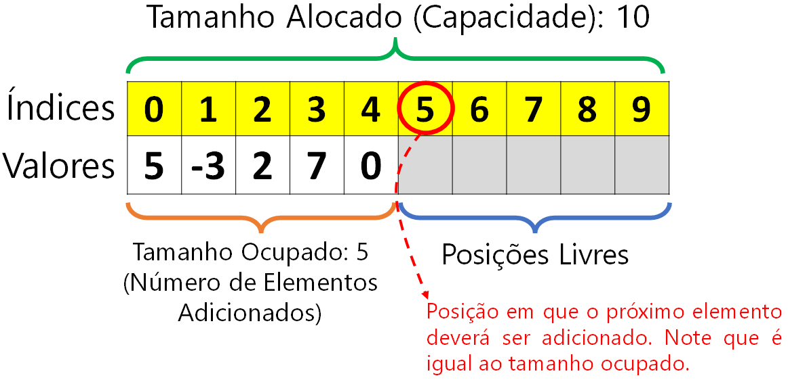
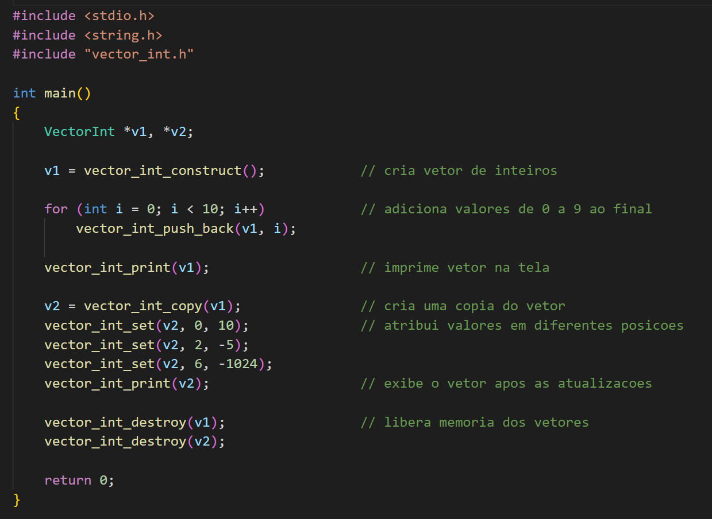
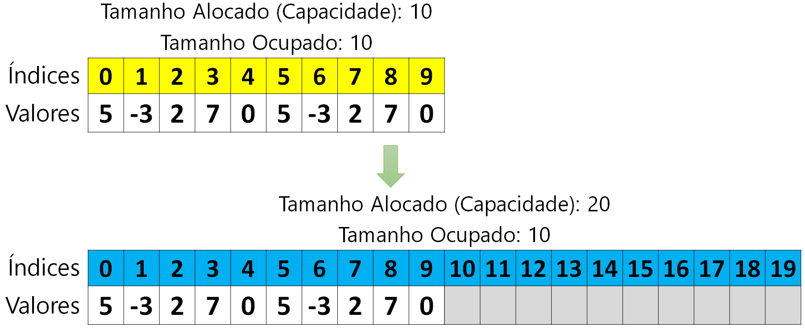

# Vectors (parte 1)

Neste laboratório, vamos implementar a estrutura de dados Vector para armazenar sequências de itens de tamanho desconhecido (não sabemos a priori quantos itens serão inseridos). Para alcançar este objetivo, utilizaremos alocação dinâmica de memória. Inicialmente, os Vectors **não** serão genéricos, isto é, eles serão capazes de armazenar apenas um tipo fixo de dados escolhido.

Este laboratório é introdutório e tem como objetivos principais relembrar como são criadas estrutras e como é feita gestão dinâmica de memória. O roteiro a seguir irá te guiar na construção do tipo de dados. 

## 0. Explicação da Estrutura de Dados

Vectors são estruturas de dados em que elementos são armazenados de forma sequencial em um array alocado dinamicamente. Diferente dos arrays que têm um tamanho estático fixo (e.g., ```int exemplo[32]```), o tamanho do vetor será ajustado  conforme necessário. Esta estrutura de dados (o Vector) é frequentemente usada em situações em que o tamanho do vetor é desconhecido ou pode mudar com o tempo. 

Como ilustrado na figura abaixo, a estrutura do Vector é composta por três atributos principais: o array de dados (chamado de valores na figura), o tamanho alocado (capacidade) e o tamanho ocupado. O atributo "valores" é um ponteiro para o primeiro elemento do vetor. A capacidade refere-se à quantidade máxima de elementos que podem ser armazenados atualmente, enquanto o tamanho ocupado é o número de elementos armazenados no vetor.


 
Uma vez contruída, gostaríamos de utilizar a estrutura de dados como ilustrado abaixo: 



## 1. Estrutura do Projeto 

Em uma pasta, crie a estrutura de diretórios e arquivos indicada a seguir: 

```
codigo/ 
    - vector.h
    - vector.c
    - main.c 
    - Makefile
```

- O arquivo ```vector.h``` irá conter a definição da estrutura (struct) e a declaração das funções de manipulação da estrutura. 

- O arquivo ```vector.c``` irá conter a definição das funções ([clique aqui para relembrar a diferença entre declaração e definição de funções](https://wiki.sj.ifsc.edu.br/index.php/Fun%C3%A7%C3%B5es_-_Programa%C3%A7%C3%A3o_1_-_Engenharia#:~:text=REAPROVEITAMENTO%20DE%20C%C3%93DIGO...-,Defini%C3%A7%C3%A3o%2C%20declara%C3%A7%C3%A3o%20e%20chamada%20de%20Fun%C3%A7%C3%B5es,pelo%20seu%20nome%20e%20passando%20os%20par%C3%A2metros%20(ATUAIS)%20que%20se%20deseja.,-Por%20que%20usar)).

- O arquivo ```main.c``` será o programa principal. Nele, vamos testar as funções para manipulação de vectors.

- O arquivo ```Makefile``` possuirá as instruções para compilação do programa e limpeza do projeto (remoção de arquivos gerados durante a compilação). **Nesta aula vamos usar o makefile simples visto na aula de revisão, com uma modificação para incluir todos os arquivos .c no executável**:

```
all:
    gcc -Wall -g -o main *.c
clean:
    rm -f main
```

## 2. Definição da Estrutura e Declaração de Funções 

Nesta subseção, vamos utilizar apenas o arquivo ```vector.h```.

1. Adicione as *include guards* para evitar o problema de redefinição de tipos e funções ao incluir o arquivo de cabeçalho mais de uma vez no projeto ([clique aqui para relembrar](https://pt.wikipedia.org/wiki/Include_guard)):

```
#ifndef _ED_VECTOR_H_
#define _ED_VECTOR_H_

// escreva o codigo aqui

#endif
```

2. A seguir, vamos definir um novo tipo chamado ```data_type``` para representar o tipo dos dados que serão armazenados em nosso Vector. Inicialmente, vamos definir que ```data_type``` será ```int```: 

```
typedef int data_type;
```

A instrução acima define ```data_type``` como um apelido para o tipo ```int```. O tipo ```data_type``` pode ser usado exatamente como o tipo ```int``` para criar variáveis e como entrada e saída de funções. Na estrutura ```Vector``` e em suas funções, deve ser usado apenas o tipo ```data_type``` e o tipo ```int``` não deve ser mencionado. **A vantagem desta abordagem é que se quisermos mudar o tipo do Vector de ```int``` para outro tipo qualquer, só precisaremos mudar a linha que contém o ```typedef```**. 

3. Crie então a estrutura Vector contendo três atributos: 
- um ponteiro do tipo ```data_type``` para indicar onde nossa sequência de dados está na memória; 
- um inteiro para armazenar a capacidade atual do Vector  i.e., o número de itens alocados ou qual é o limite máximo de itens que podemos armazenar; e 
- um inteiro para armazenar o tamanho do vector, i.e., quantos itens de fato foram inseridos até o momento.

```
typedef struct
{
    data_type *data;
    int size;
    int allocated;
} Vector;
```

**Mantenha os atributos com os nomes especificados acima para este laboratório e defina a estrutura no arquivo .h**.

4. Adicione as declarações das funções para manipulação de vectors que vamos implementar. Utilizaremos na disciplina o padrão de nomear as funções como ```tipo_acao```, por exemplo, ```vector_construct```. Implementaremos as seguintes funções: 

```
// Aloca espaço para um elemento do tipo vector e inicializa os seus atributos.
Vector *vector_construct(); 

// Libera o espaço reservado para o vector.
void vector_destroy(Vector *v); 

// Adiciona o item dado ao final do vector e aumenta o tamanho. Aumenta a capacidade alocada se necessário.
void vector_push_back(Vector *v, data_type val); 

// Retorna o número de elementos atualmente no vector.
int vector_size(Vector *v); 

// Retorna o i-ésimo elemento do vector.
data_type vector_get(Vector *v, int i); 

// Atualiza o i-ésimo elemento do vector  para que ele passe a ter o valor val. 
void vector_set(Vector *v, int i, data_type val); 

// Retorna o índice da primeira ocorrência do item no Vector ou -1 se o elemento não for encontrado.
int vector_find(Vector *v, data_type val); 
```

## 3. Construção e Destruição de Vectors

Vamos começar a modificar o arquivo ```vector.c``` para implementar as funções de construção e destruição de variáveis do tipo Vector. Inclua a biblioteca ```stdlib.h``` no início do arquivo pois ela contém as declarações das funções para alocação dinâmica de memória.

1. Implemente a função ```Vector *vector_construct()```: Use a função calloc ([explicacao](http://mtm.ufsc.br/~azeredo/cursoC/aulas/ca60.html)) para alocar espaço para um Vector. Em seguida, inicialize o tamanho alocado com um valor padrão (10, por exemplo) e o tamanho como zero. Por fim, use a função calloc novamente para alocar espaço para o array de dados do tipo ```data_type```. Deve ser reservado espaço para tantos itens quanto o valor atribuído ao tamanho alocado. 

2. Implemente a função ```void vector_destroy(Vector *v)```: Use a função free ([explicacao](explicacao)) para liberar o espaço alocado para os itens do vetor e para liberar ```v```.

É uma boa prática testar as funções à medida que as desenvolvemos para ter certeza que elas estão corretas. Para isto, vamos modificar o arquivo ```main.c``` para criar um vector e então destruí-lo:  

```
#include <stdio.h> 
#include "vector.h"

int main()
{
    Vector *v = vector_construct();
    vector_destroy(v);  

    printf("OK!\n");

    return 0;
}
```

Compile o programa e o execute. Verifique que a mensagem "OK!" foi exibida na tela. Se você possui familiaridade com o valgrind, use-o para para verificar que a memória foi gerenciada corretamente pelo programa: 

```
valgrind --leak-check=full --show-leak-kinds=all --track-origins=yes ./main
```

Os parâmetros são, resumidamente:

* --leak-check=full: cada vazamento individual será mostrado em detalhes.
* --show-leak-kinds=all: mostra todos os tipos de vazamento no relatório.
* --track-origins=yes: Rastreia as origens de valores não inicializados, o que pode ser muito útil para erros de memória. Considere desligar se o valgrind estiver lento demais.

Acesse o sistema [Testr](http://200.137.66.71:8000/testr/) e use o seu código para resolver a questão 1.

## 4. Inserção de Elementos ao Final

Ao inserir novos elementos no fim do Vector, existem duas situações possíveis. Na primeira, o tamanho é menor que a capacidade, como na figura da seção 0. Neste caso, podemos inserir o elemento na primeira posição livre (posição 5 no exemplo daquela seção). A segunda possibilidade é ilustrada na figura abaixo. Se o número de elementos inseridos for igual à capacidade, não existe mais espaço para novos elementos. Neste caso, devemo primeiro aumentar a capacidade utilizando a função realloc ([explicacao](http://mtm.ufsc.br/~azeredo/cursoC/aulas/ca60.html)).   



1. Implemente a função ```void vector_push_back(Vector *v, data_type val)```: Primeiro, verifique se a capacidade máxima do vetor foi atingida, isto é, se o tamanho é maior ou igual ao espaço alocado. Se sim, utilize a função realloc para aumentar a capacidade máxima para o dobro. Lembre-se de atualizar a variável que armazena o tamanho alocado. Por fim, adicione o novo item na primeira posição livre no vetor. 

Modifique o programa main.c e use um loop for e a função vector_push_back para adicionar os elementos de 1 a 25 no Vector. Faça outro loop for para exibir os elementos na tela e verifique que eles estão corretos. Use o valgrind para verificar se mesmo com os reallocs a memória foi utilização corretamente.

Acesse o sistema [Testr](http://200.137.66.71:8000/testr/) e use o seu código para resolver a questão 2.

## 5. Obtenção e Atualização de Elementos usando os Índices e Obtenção do Tamanho 

1. Implemente a função ```int vector_size(Vector *v)```. Esta função é bem simples e deve apenas retornar o número de elementos já inseridos no vetor.

2. Implemente a função ```data_type vector_get(Vector *v, int i)```: Verifique se o índice é válido e, se sim, retorne elemento da respectiva posição. Caso contrário, mostre uma mensagem de erro informativa na tela e encerre o programa usando a função exit. **Importante**: Um índice é válido se ele não for negativo e for menor que o tamanho do vector.

3. Implemente a função ```void vector_set(Vector *v, int i, data_type val)```: Ela é similar à função anterior, mas deve atribuir um valor à i-ésima posição ao invés de obter o valor.

Modifique o programa main.c para que não sejam feitos acessos diretos aos atributos da estrutura Vector no programa principal. As funções acima devem ser usadas para recuperar o tamanho e para listar os itens no segundo for. Após realizar as modificações acima, adicione outro for que substitua os elementos por seu dobro usando as funções ```vector_get``` e ```vector_set```. Mostre os elementos na tela novamente e verifique que estão corretos. Teste o programa usando o valgrind.

Acesse o sistema [Testr](http://200.137.66.71:8000/testr/) e use o seu código para resolver a questão 3.

## 6. Busca por um elemento 

1. Implemente a função ```int vector_find(Vector *v, data_type val)```. Para isto, faça um loop for com um índice iniciando em 0 e indo até a última posição válida do vetor (tamanho - 1). Para cada valor do índice verifique se o elemento daquela posição é igual ao item buscado. Em caso afirmativo, retorne o índice. Se ao final do for o elemento não foi encontrado, podemos concluir que ele não existe e devemos retornar -1.

Modifique o programa main.c anterior de forma que inicialmente leia dois números inteiros ```m``` e ```n```. Em seguida, leia ```m``` números inteiros e adicione-os no vector usando a função ```vector_push_back```. Por fim, leia ```n``` números inteiros e mostre na tela os índices dos números (-1 se não existir), um por linha. Novamente, teste o programa usando o valgrind.

Acesse o sistema [Testr](http://200.137.66.71:8000/testr/) e use o seu código para resolver a questão 4.

## Atividades Extras 

1. Implemente funções ```void vector_save(Vector *v, char *file)``` e ```Vector *vector_load(char *file)``` para salvar e ler o Vector de um arquivo texto. Primeiro, resolva a questão sabendo que o tipo dos elementos é ```int```. 

2. Crie versões alternativas das funções para salvar e ler os dados em formato binários. 

3. Modifique as funções para receber como argumento um ponteiro de função que especifique como escrever/ler os itens do vetor. Use o ponteiro de função para remover a dependência do tipo ```int```. As assinaturas das funções passariam a ser: 

```
void vector_save(Vector *v, char *file, void (*write_item)(FILE*, data_type));

Vector *vector_load(char *file, data_type (*load_item)(FILE*));
```

4. Modifique o ```data_type``` para ```char*``` de forma que o Vector armazene strings. No arquivo ```main.c```, use o tipo Vector para armazenar as linhas de um arquivo texto. Assuma que o tamanho máximo de cada linha é 128. Crie um arquivo de exemplo e verifique se as linhas foram armazenadas corretamente no Vector. Use o valgrind para verificar que todos os espaços alocados foram liberados e que não aconteceram invasões de memória.
