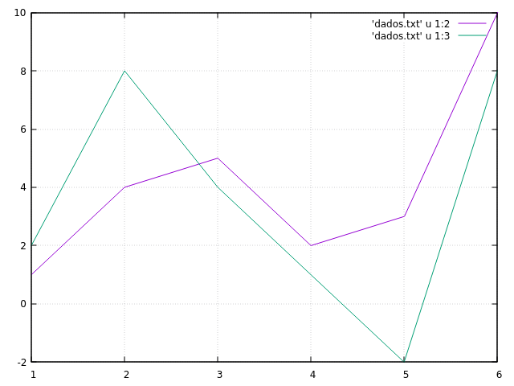

# Análise Empírica de Algoritmos

Neste laboratório, vamos analisar de forma empírica (via experimentos computacionais) como o tempo de execução de diferentes algoritmos para uma dada tarefa se comportam para diferentes tamanhos e características de entradas. 

**Nota**: Quem não implementou o tipo Vector, pode utilizar a implementação do tipo Vector disponível no AVA na Semana 02.

## Medindo Tempo de Execução de Algoritmos 

Existem várias formas de medir a passagem de tempo em C. Algumas, por exemplo, estimam a quantidade de tempo em que o processador foi utilizado para executar as operações do programa. Outras, como aquela que utilizaremos na aula, medem o tempo passando entre dois pontos do programa. Utilizaremos a função ```timespec_get``` para obter um número de ponto flutuante indicando quantos segundos passaram desde uma data de referência (veja [mais informações](https://en.cppreference.com/w/c/chrono/timespec_get)). 

Primeiro, vamos criar uma função utilitária ```get_timestamp``` que obtém o número de segundos e nanosegundos desde a data de referência como inteiros e, em seguida, transforma os nanosegundos para segundos e soma ao valor de segundos inicial.

```
#include <time.h>

double get_timestamp()
{
    struct timespec now;
    timespec_get(&now, TIME_UTC);
    return now.tv_sec + (((double)now.tv_nsec) / 1e9);
}
```

Dada esta função, podemos medir a diferença de tempo entre dois pontos do programa usando a função para obter a representação do instante de tempo em segundos e subtraindo os dois valores: 

```
double start = get_timestamp(); 

// trecho que queremos medir

double end = get_timestamp(); 

// tempo passado entre os dois pontos do código
double dt = (end - start);
```

**Observação**: Os recursos do computador são tipicamente compartilhados por vários programas (browser de internet, IDE, gestor de interface gráfica, etc.). A medida de duração de trechos de código pode ser influenciada por estes fato. Considere, por exemplo, o  caso extremo em que um programa usa toda a memória disponível e faz com que os outros programas "travem". Um trecho de código que normalmente seria executado em milisegundos, pode demorar vários segundos neste contexto. Portanto, **ao realizar testes de duração de execução, busque, pelo menos, finalizar programas que usam muitos recursos e tire a média de várias medições de forma que o efeito de ruídos sejam minimizados**.

## Gerando Números Aleatórios em C

Para gerar um número inteiro aleatório em C, utilizamos a função ```rand``` definida na ```stdlib.h```: 

```
#include <stdlib.h>

int main()
{
    int x = rand();

    // (...)
}
```

A função ```rand``` retorna um valor entre ```0``` e ```RAND_MAX=2147483647```. Para limitar o valor máximo em um dado valor ```N```, podemos utilizar a função de resto da divisão inteira ```rand() % N``` já que o resultado desta operação será um valor entre ```0``` e ```N```. 

Os números aleatórios em C não são de fato aleatórios, mas sim pseudoaleatórios ([saiba mais](https://en.wikipedia.org/wiki/Pseudorandom_number_generator)). Eles se parecem com números aleatórios, mas são produzidos usando uma função determinística a partir de um valor inicial chamado de ```semente (seed)```. Ao definir um valor para a semente, a mesma sequência de valores será produzido ao invocar a fução ```rand``` repetidamente.

Para que sequências diferentes sejam produzidas ao executar os programas, vamos iniciar a semente no inicio do programa usando o instante de tempo atual como ponto de partida. Como o tempo passa, sementes diferentes serão usadas como ponto de partida a cada execução. Para definir a semente usamos a função ```srand``` no início do programa, como indicado a seguir:

```
#include <stdlib.h>
#include <time.h>

(...)

int main()
{
    srand(time(NULL));
    
    int x = rand();
}
```

## Geração de Gráficos com o Gnuplot

Para produzir gráficos em nossa análise, utilizaremos um programa de linha de comando chamado gnuplot. Abra um terminal de comandos na pasta onde seus código serão armazenados e digite ```gnuplot```: 

```
>> gnuplot 

    G N U P L O T
    Version 5.4 patchlevel 2    last modified 2021-06-01

    Copyright (C) 1986-1993, 1998, 2004, 2007-2021
    Thomas Williams, Colin Kelley and many others

    gnuplot home:     http://www.gnuplot.info
    faq, bugs, etc:   type "help FAQ"
    immediate help:   type "help"  (plot window: hit 'h')

Terminal type is now 'qt'
gnuplot>
```

Para plotar o gráfico da função seno, utilizamos o comando ```plot```. O atributo ```title``` permite definir o nome que aparecerá na legenda associado à curva:

```
gnuplot> plot sin(x) title 'seno'
```

O comando ```plot``` cria um novo gráfico. Para plotar outro gráfico junto ao anterior, utilizamos o comando ```replot```: 

```
gnuplot> replot cos(x) title 'cosseno'
```

Alternativamente, podemos escrever as duas curvas na mesma linha separando elas por vírgula: 

```
gnuplot> plot sin(x) title 'seno', cos(x) title 'cosseno'
```

Para permitir uma melhor comparação dos valores das funções, podemos sobrepor uma grade no gráfico usando o comando ```set grid``` e, em seguida, plotando novamente os gráficos: 

```
gnuplot> set grid
gnuplot> plot sin(x) title 'seno', cos(x) title 'cosseno'
```

Suponha que queremos comparar as funções seno e cosseno com uma função quadrática. Podemos fazer isso, utilizando o comando: 

```
gnuplot> plot sin(x) title 'seno', cos(x) title 'cosseno', x**2 title 'quadrado'
```

Contudo, como a quadrática cresce mais rápido que as trigonométricas, o gráfico provavelmente irá "achatar" as funções seno e cosseno. Podemos amenizar este efeito, definindo que o gráfico mostre apenas valores para ```x``` entre ```-2``` e ```2``` usando a função ```xrange``` (existe uma similar para o eixo y chamada ```yrange```).

```
gnuplot> set xrange[-2:2]
gnuplot> plot sin(x) title 'seno', cos(x) title 'cosseno', x**2 title 'quadrado'
```

Por fim, o gnuplot é capaz de exibir gráficos de arquivos em formato tabular. Crie um arquivo chamado ```dados.txt``` com o conteúdo a seguir (separe os valores por espaço):

```
x y1 y2 
1 1 2
2 4 8
3 5 4
4 2 1
5 3 -2
6 10 8
```

Para exibir os dados como pontos em um gráfico, vamos primeiro desativar a limitação do eixo x e usamos o comando plot para produzir o gráfico. O modificador ```using 1:2``` indica que a primeira coluna será usada como valor do ```eixo x``` e a segunda coluna será usada como valor do ```eixo y```.

```
gnuplot> unset xrange
gnuplot> plot 'dados.txt' using 1:2
```

Note que as linhas são exibidas como cruzes no gráfico. Para exibir como uma linha, adicionamos o modificador ```with lines```: 

```
gnuplot> plot 'dados.txt' using 1:2 with lines
```

Para plotar no mesmo gráfico a curva definida pela primeira e terceira coluna, fazemos: 

```
gnuplot> plot 'dados.txt' using 1:2 with lines, 'dados.txt' using 1:3 with lines
```

O gnuplot possui alguns atalhos para reduzir o número de caracteres digitados. Podemos, por exemplo, abreviar o ```using``` por ```u```, ```with``` por ```w``` e o ```lines``` por ```l```. Para aumentar a largura das linhas podemos usar ```lw 4```, por exemplo onde o ```lw``` se refere a line width (largura da linha). 

```
gnuplot> plot 'dados.txt' u 1:2 w l, 'dados.txt' u 1:3 w l
```



## Análise Empírica do Método de Busca Linear

Nesta tarefa, vamos **estimar** a performance do algoritmo de busca linear no melhor caso, pior caso e caso médio, assumindo que o item buscado está no vetor. 

Faça um programa que crie iterativamente vetores com N valores, para N variando de 1 até 2000 de 200 em 250. Para cada vetor, selecione M=1000 valores aleatórios uniformemente no vetor e meça o tempo necessário para buscar o índice do elemento usando busca linear. Para cada valor de N, mostre na tela o menor tempo (estimativa do melhor caso), o maior tempo (estimativa do pior caso) e o tempo médio (estimativa do caso médio) das M repetições com 7 casas após a vírgula. Mostre os dados no formato dado a seguir (**os valores são fictícios e não refletem a realidade e omitimos casas após a vírgula para uma melhor visualização**): 

```
N menor maior media
1 0.01 0.3 0.10
250 0.01 0.4 0.10
500 0.01 0.5 0.20
...
4750 0.01 1.3 0.45
5000 0.01 1.5 0.50
```

Execute o programa e use o operador ```>``` para salvar os valores exibidos na tela em um arquivo: 

```
>> ./main > busca-linear.txt
```

Use o gnuplot para plotar um gráfico das estimativas e use um título adequado para descrever as curvas. Adicione o grid no gráfico e use os comandos para delimitar o ```xrange``` e ```yrange``` para uma melhor visualização de partes específicas dos gráficos. Analisando as curvas reflita se: 

* A curva do pior caso cresce como esperado, i.e., como uma função linear? 
* E a do melhor caso? Ela é aproximadamente constante? Se não, como você explicaria isso?  
* A curva do caso médio cresce na mesma taxa que o pior caso? 
* Na aula, vimos que o caso médio da busca linear é 2x mais rápido que o pior caso. Isto é visível no gráfico? 
* A curva do pior caso está sempre acima do melhor caso e do caso médio? Se não, em que região isto não acontece e por quê? 

A abordagem aproximação das estatísticas (min, max e média) a partir de amotras descrita acima é um ponto de partida para quando não temos idéia da complexidade de um método ou para o caso que a implementação não está disponível. 

Quanto maior o valor de M, mais precisa será a estimativa da média. Para alcançar a mesma propriedade para as demais estatísticas (min e max), poderíamos realizar várias medições para cada número sorteado e tirar a média dentre elas. 

Para avaliar o quão boas foram as estimativas do melhor caso e do pior caso, modifique o programa para que também sejam exibidos, para cada valor de N, os tempos para buscar o primeiro e último elementos do vetor. Compare as curvas usando o melhor caso e o pior caso reais e aqueles obtidos das amostras: 

* A diferença entre as curvas é grande?  
* As curvas do pior caso real e do pior caso estimado crescem de formas similares? 
* E do melhor caso? 

## Análise Empírica da Busca Binária

Repita o processo acima para a busca binária e salve os resultados em outro arquivo. Lembre-se de criar vetores ordenados. Responda as perguntas da seção anterior.

Em seguida, plote em um gráfico mostrando os tempos estimados do melhor caso, do caso médio e do pior caso da busca binária e da busca linear. Em seguida, responda as seguintes perguntas:

* O pior caso e o caso média da busca binária crescem aproximadamente de acordo com a mesma taxa?
* A diferença entre os piores casos da busca linear e binária refletem o que foi visto em sala, i.e., que a busca binária segue uma função linear e a binária uma função log? 
* O efeito de crescimento da diferença entre os piores casos e os casos médios foi observado na prática? 

## Análise Empírica da Ordenação usando o Bubble Sort

Repita o processo acima para a ordenação usando o bubble sort e salve os resultados em outro arquivo. Para cada M, deve ser criado um novo vetor preenchido com valores aleatórios entre 0 e N. Lembre-se que o bubble sort deve terminar quando não houverem mais trocas.

* Analisando os gráficos do melhor caso, do pior caso e do caso médio empírico você é capaz de adivinhar as funções que descrevem as taxas de crescimento do tempo em função do tamanho do vetor?

Olhando para o algoritmo, identificar as características dos vetores que levam ao melhor caso e ao pior caso. Tente também inferir a "cara" das funções que descrevem a taxa de crescimento do tempo em função do tamanho do vetor no melhor caso e no pior caso. 

Modifique o programa que mede os tempos e gere os vetores com as características que você acha que vão levar ao melhor e pior caso teórico. Meça os tempos e compare as curvas com as estimativas amostrais. 

Plote um gráfico com o pior caso da busca binária, da busca linear e do bubble sort. Em conjunto, plote os gráficos das funções que você acha que descrevem a taxa de crescimento dos tempos em função das entradas dentre as possibilidades: 1, lg N, N, N lg N, N^2, N^3, 2^N. 

* **Importante**: Na sala, comentamos que para valores grandes de N, ao comparar as funções para 2 ou mais algoritmos com complexidades diferentes, as constantes deveriam ser desprezíveis. Os tempos medidos se diferenciam das funções teóricas por constantes multiplicativas ou aditivas. Compare as curvas que descrevem os tempos com as funções que representam as taxas de crescimento teóricas do tempo para 2 algoritmos com complexidades diferentes (e.g., bubble sort e linear). Se as constantes forem desprezíveis, as curvas teóricas deveriam ficar próximas das empíricas. Isso foi observado nos seus gráficos? Se não, por quê? Você é capaz desenhar um experimento para avaliar se sua justificativa é válida?

## Busca com Ordenação Inicial

Considere um vetor de tamanho 1000, inicialmente preenchido com valores aleatórios. Compare o tempo total para buscar M itens de posições aleatórias do vetor com busca lineares e o tempo somado de ordenar o vetor primeiro usando bubble sort e a partir daí buscar os M itens usando busca binária. Plote os gráficos para diferentes valores de M.

* O que é mais vantajoso, usar sempre buscas lineares ou ordenar primeiro e depois realizar buscas binárias? Em que situações um é melhor que o outro? 
* A partir de que valor de M se torna vantajoso ordenar antes e realizar buscas aleatórias? 
* Na sua opinião, usar outro algoritmo de ordenação como o quick sort faria diferença na análise? Por quê? Quais diferenças você esperaria encontrar?

## [Extra] Análise Empírica do Algoritmo Quick Sort

Implemente uma função de ordenação que use o qsort. Faça o procedimento de medir os tempos e estimar a curva de evolução do tempo para diferentes valores de N (tamanho do vetor) no melhor caso, pior caso e caso médio. Como nas seções anteriores, para cada valor de N, gere M vetores com valores aleatórios e use a função para ordenar os vetores. Compare o pior caso e o caso médio com os respectivos casos da busca linear, busca binária e bubble sort. Tente inferir que funções matemáticas descrevem a evolução do tempo no caso médio e no pior caso.

O que você que aconteceria na análise da seção anterior se o quick sort fosse usado ao invés do bubble sort? Faça as medidas e verifique se suas expectativas se confirmaram.
