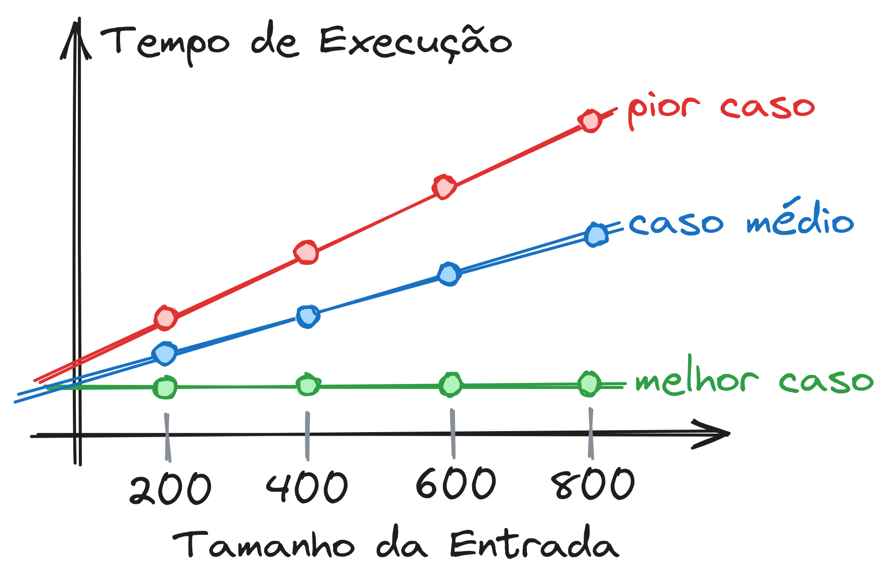
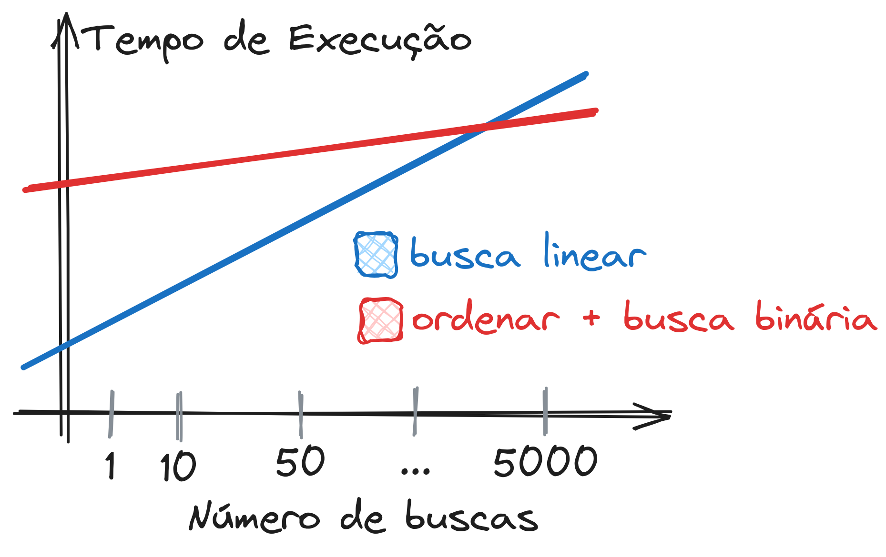

# Análise Empírica de Algoritmos

- [Informações Gerais](#informações-gerais)
- [Medindo Tempo de Execução de Algoritmos](#medindo-tempo-de-execução-de-algoritmos)
- [Gerando Números Aleatórios em C](#gerando-números-aleatórios-em-c)
- [Geração de Gráficos com o Gnuplot](#geração-de-gráficos-com-o-gnuplot)
- [Análise Empírica do Tempo de Execução da Busca Linear](#análise-empírica-do-tempo-de-execução-da-busca-linear)
  - [Explicação da Metodologia](#explicação-da-metodologia)
  - [Perguntas](#perguntas)
- [Análise Empírica da Busca Binária](#análise-empírica-da-busca-binária)
  - [Perguntas](#perguntas-1)
- [Análise Empírica da Ordenação usando o Bubble Sort](#análise-empírica-da-ordenação-usando-o-bubble-sort)
  - [Perguntas](#perguntas-2)
- [Comparando Curvas de Crescimento de Tempo](#comparando-curvas-de-crescimento-de-tempo)
- [Busca Linear vs. Ordenação + Busca Binária](#busca-linear-vs-ordenação--busca-binária)
  - [Perguntas](#perguntas-3)
- [\[Extra\] Análise Empírica do Algoritmo Quick Sort](#extra-análise-empírica-do-algoritmo-quick-sort)

## Informações Gerais

**Contexto:** Neste laboratório, vamos analisar de forma empírica (via experimentos computacionais) como o tempo de execução de alguns algoritmos variam para diferentes tamanhos de entradas.

**Tarefa (Data Limite: 04/08/2024):** Use um editor texto como o libre office writer do linux ou google docs ou word para responder as perguntas em tópicos. Envie as respostas como pdf na tarefa do AVA até a data limite. adicione imagens de gráficos no texto, se achar necessário, para ajudar nas respostas.

**Nota**: Quem não implementou o tipo Vector, pode utilizar a implementação do tipo Vector disponível no AVA na Semana 02.

## Medindo Tempo de Execução de Algoritmos

Existem diversas formas de medir a passagem de tempo em C. Nesta aula, utilizaremos a função ```timespec_get``` da biblioteca ```time.h``` para obter quantos segundos e nanossegundos se passaram desde uma data de referência (veja [mais informações](https://en.cppreference.com/w/c/chrono/timespec_get)).

Vamos criar uma função utilitária ```get_timestamp``` para retornar o tempo em segundos (float) ao invés de retornar dois valores inteiros para segundos e nanossegundos. A função transforma nanosegundos para fração de segundos dividindo o valor por $10^9$ e, em seguida, soma o resultado ao valor de segundos.

```C
#include <time.h>

double get_timestamp()
{
    struct timespec now;
    timespec_get(&now, TIME_UTC);
    return now.tv_sec + (((double)now.tv_nsec) / 1e9);
}
```

Com esta função, podemos medir a diferença de tempo entre dois pontos do programa:

```C
double start = get_timestamp();

// **************************
// trecho que queremos avaliar
// **************************

double end = get_timestamp();

// tempo passado entre os dois pontos do código
double dt = (end - start);
```

**IMPORTANTE**: Os recursos do computador são tipicamente compartilhados por vários programas (browser de internet, IDE, gestor de interface gráfica, etc.). A medida de duração de trechos de código pode ser influenciada por estes fato. Considere, por exemplo, o caso extremo em que um programa usa toda a memória disponível e faz com que os outros programas "travem". Um trecho de código que normalmente seria executado em milisegundos, pode demorar vários segundos neste contexto. Portanto, **ao realizar testes de duração de execução, busque, pelo menos, finalizar programas que usam muitos recursos e tire a média de várias medições de forma que o efeito de ruídos sejam minimizados**.

## Gerando Números Aleatórios em C

Para gerar um número inteiro aleatório em C, utilizamos a função ```rand``` definida na ```stdlib.h```:

```C
#include <stdlib.h>

int main()
{
    int x = rand();

    // (...)
}
```

A função ```rand``` retorna um valor entre ```0``` e ```RAND_MAX=2147483647```. Para limitar o valor máximo em um dado valor ```N```, podemos utilizar a função de resto da divisão inteira ```rand() % N``` já que o resultado desta operação será um valor entre ```0``` e ```N```.

Os números aleatórios em C não são de fato aleatórios, mas sim pseudoaleatórios ([saiba mais](https://en.wikipedia.org/wiki/Pseudorandom_number_generator)). Eles se parecem com números aleatórios, mas são produzidos usando uma função determinística a partir de um valor inicial chamado de ```semente (seed)```. Ao definir um valor para a semente, a mesma sequência de valores será produzido ao invocar a fução ```rand``` repetidamente.

Para que sequências diferentes sejam produzidas ao executar os programas, vamos iniciar a semente no inicio do programa usando o instante de tempo atual como ponto de partida. Como o tempo passa, sementes diferentes serão usadas como ponto de partida a cada execução. Para definir a semente usamos a função ```srand``` :

```C
#include <stdlib.h>
#include <time.h>

(...)

int main()
{
    // inicia a semente do sistema de geração
    // de números aleatórios com o instante atual.
    srand(time(NULL));

    int x = rand();
}
```

## Geração de Gráficos com o Gnuplot

Para produzir gráficos, utilizaremos um programa de linha de comando chamado gnuplot. Abra um terminal de comandos na pasta onde seus código serão armazenados e digite ```gnuplot```:

```shell
>> gnuplot

    G N U P L O T
    Version 5.4 patchlevel 2    last modified 2021-06-01

    Copyright (C) 1986-1993, 1998, 2004, 2007-2021
    Thomas Williams, Colin Kelley and many others

    gnuplot home:     http://www.gnuplot.info
    faq, bugs, etc:   type "help FAQ"
    immediate help:   type "help"  (plot window: hit 'h')

Terminal type is now 'qt'
gnuplot>
```

Para plotar o gráfico da função seno, utilizamos o comando ```plot```. O atributo ```title``` permite definir o nome que aparecerá na legenda associado à curva:

```shell
gnuplot> plot sin(x) title 'seno'
```

O comando ```plot``` cria um novo gráfico. Para plotar outro gráfico junto ao anterior, utilizamos o comando ```replot```:

```shell
gnuplot> replot cos(x) title 'cosseno'
```

Alternativamente, podemos escrever as duas curvas na mesma linha separando elas por vírgula:

```shell
gnuplot> plot sin(x) title 'seno', cos(x) title 'cosseno'
```

Para permitir uma melhor comparação dos valores das funções, podemos sobrepor uma grade no gráfico usando o comando ```set grid``` e, em seguida, plotando novamente os gráficos:

```shell
gnuplot> set grid
gnuplot> plot sin(x) title 'seno', cos(x) title 'cosseno'
```

Suponha que queremos comparar as funções seno e cosseno com uma função quadrática. Podemos fazer isso, utilizando o comando:

```shell
gnuplot> plot sin(x) title 'seno', cos(x) title 'cosseno', x**2 title 'quadrado'
```

Contudo, como a quadrática cresce mais rápido que as trigonométricas, o gráfico provavelmente irá "achatar" as funções seno e cosseno. Podemos amenizar este efeito, definindo que o gráfico mostre apenas valores para ```x``` entre ```-2``` e ```2``` usando a função ```xrange``` (existe uma similar para o eixo y chamada ```yrange```).

```shell
gnuplot> set xrange[-2:2]
gnuplot> plot sin(x) title 'seno', cos(x) title 'cosseno', x**2 title 'quadrado'
```

Por fim, o gnuplot é capaz de exibir gráficos de arquivos em formato tabular. Crie um arquivo chamado ```dados.txt``` com o conteúdo a seguir (separe os valores por espaço):

```
x y1 y2
1 1 2
2 4 8
3 5 4
4 2 1
5 3 -2
6 10 8
```

Para exibir os dados como pontos em um gráfico, vamos primeiro desativar a limitação do eixo x usando o comando ```unset xrange``` e, em seguida, usar o comando ```plot``` para produzir o gráfico.

```shell
gnuplot> unset xrange
gnuplot> plot 'dados.txt' using 1:2
```

O modificador ```using 1:2``` indica que a primeira coluna será usada como valor do ```eixo x``` e a segunda coluna será usada como valor do ```eixo y```.

Note que as linhas são exibidas como cruzes no gráfico. Para exibir como uma linha, adicionamos o modificador ```with lines```:

```shell
gnuplot> plot 'dados.txt' using 1:2 with lines
```

Para plotar no mesmo gráfico a curva definida pela primeira e terceira colunas, fazemos:

```shell
gnuplot> plot 'dados.txt' using 1:2 with lines, 'dados.txt' using 1:3 with lines
```

O gnuplot possui alguns atalhos para reduzir o número de caracteres digitados. Podemos, por exemplo, abreviar o ```using``` por ```u```, ```with``` por ```w``` e o ```lines``` por ```l```. Para aumentar a largura das linhas podemos usar ```lw 4```, por exemplo onde o ```lw``` se refere a line width (largura da linha).

```shell
gnuplot> plot 'dados.txt' u 1:2 w l, 'dados.txt' u 1:3 w l
```


## Análise Empírica do Tempo de Execução da Busca Linear

### Explicação da Metodologia

A análise empírica de algoritmos envolve a medição do tempo de execução de algoritmos para conjuntos de dados com diferentes tamanhos e características. O objetivo é construir uma intuição de como é a função de crescimento do tempo, ao invés de fazer previsões teóricas. O resultado das análises são gráficos como este ilustrado abaixo, em que o eixo ```x``` representa os diferentes tamanhos de entrada e o eixo ```y``` representa o tempo de execução médio para aquele tamanho de entrada.



Os seguintes passos devem ser seguidos no processo de análise empírica:

1. **Definir as condições de melhor caso, caso médio e pior caso**. Por exemplo, na busca linear, o melhor caso acontece quando o elemento buscado está na primeira posição do array e o pior caso acontece quando o elemento está na última posição ou não existe no array. No caso médio, o elemento pode estar em qualquer posição do array, com igual probabilidade (desconsiderando o caso em que o valor buscado não existe no array). Vamos simular este caso escolhendo um índice aleatório e buscando o elemento que está naquela posição.
    * **Observação**: Quando não temos clareza em que situações os casos acontecem ou quando temos acesso à versão binária do código, mas não o código-fonte, podemos **aproximar** (possivelmente com quantidade substancial de erro) os tempos executando o algoritmo várias vezes e escolhendo o menor tempo como melhor caso e o maior tempo como pior caso. Vale enfatizar que para obter estimativas realistas, o número de repetições deve ser grande. Para reduzir a quantidade de ruído, o procedimento pode ser repetido várias vezes para calcular o melhor caso médio e o pior caso médio.

2. **Coleta de Dados**: Executar o algoritmo para cada caso um certo número de vezes (e.g., 20 vezes) e tirar a média dos tempos para reduzir o efeito de medições ruidosas. Como resultado desta etapa, teremos três medições, as médias para o melhor caso e o pior caso e o tempo do caso médio.
3. **Variar os Tamanhos de Entrada**: A coleta de dados deve ser repetida para diferentes tamanhos de arrays. Para a busca linear usaremos os valores $[200, 400, ..., 1800, 2000]$. As medições de melhor caso, caso médio e pior caso devem ser realizadas para cada tamanho. Os dados devem ser salvos em um arquivo de forma que seja possível plotar os gráficos usando gnuplot.
4. **Plotar gráficos**: Usando as medições, o gnuplot deve ser usado para plotar os gráficos de melhor caso, caso médio e pior caso.

O pseudocódigo a seguir, descreve o processo de análise empírica. A operação em análise neste exemplo é a função ```vector_find```.

```C
srand(time(NULL));

Para tamanhos de vetor entre [200, 400, ..., 1800, 2000]:

    Crie um vetor V do tamanho selecionado e preencha-o com valores aleatórios

    Para cada caso (melhor caso, caso médio ou pior caso):

        // M é o numero de repeticoes do experimento
        int M = 1000;
        float tempos[M];

        Para i variando de 0 a M:

            double inicio = get_timestamp();

            // ******************
            // operação em análise
            // ******************

            double fim = get_timestamp();
            double duracao = fim - inicio;

            // armazena o tempo da execução do algoritmo
            tempos[i] = duracao;

        // o tempo do experimento é a média dos M tempos
        tempo_experimento = media(tempos, M);

    // IMPORTANTE: SALVE OS DADOS COM 7 CASAS APÓS A VÍRGULA PORQUE OS TEMPOS PODEM SER BEM PEQUENOS EM ALGUNS CASOS.
    Mostre na tela (ou salve em arquivo) o tamanho do vetor e os tempos médios no melhor caso, caso médio e pior caso.
```

Os dados resultantes do processo devem ter o seguinte formato (**os valores são fictícios e não refletem a realidade e omitimos casas após a vírgula para uma melhor visualização**):

```
N menor maior media
1 0.01 0.3 0.10
201 0.01 0.4 0.10
401 0.01 0.5 0.20
...
1801 0.01 1.3 0.45
2001 0.01 1.5 0.50
```

Se o programa mostrar o resultado na tela ao invés de salvar em arquivo, use o operador ```>``` para redirecionar a saída padrão para um arquivo:

```shell
>> ./main > busca-linear.txt
```

Use o gnuplot para plotar um gráfico das estimativas e use um título adequado para descrever as curvas. Adicione o grid no gráfico e use os comandos para delimitar o ```xrange``` e ```yrange``` para uma melhor visualização de partes específicas dos gráficos.

### Perguntas

Analisando as curvas reflita se:

* A curva do pior caso cresce como esperado, i.e., como uma função linear?
* E a do melhor caso? Ela é aproximadamente constante? Se não, como você explicaria isso?
* A curva do caso médio cresce na mesma taxa que o pior caso?
* Na aula, vimos que o caso médio da busca linear é 2x mais rápido que o pior caso. Isto é visível no gráfico?
* A curva do pior caso está sempre acima do melhor caso e do caso médio? Se não, em que região isto não acontece e por quê?

## Análise Empírica da Busca Binária

Repita o processo acima para a busca binária e salve os resultados em outro arquivo. Lembre-se de criar vetores ordenados. Responda as perguntas da seção anterior.

Em seguida, plote em um gráfico mostrando os tempos estimados do melhor caso, do caso médio e do pior caso da busca binária e da busca linear. Em seguida, responda as seguintes perguntas:

### Perguntas

* O pior caso e o caso média da busca binária crescem aproximadamente de acordo com a mesma taxa?
* A diferença entre os piores casos da busca linear e binária refletem o que foi visto em sala, i.e., que a busca binária segue uma função linear e a binária uma função log?
* O efeito de crescimento da diferença entre os piores casos e os casos médios foi observado na prática?

## Análise Empírica da Ordenação usando o Bubble Sort

Repita o processo acima para a ordenação usando o bubble sort e salve os resultados em outro arquivo. Para cada repetição do experimento, deve ser criado um novo vetor preenchido com valores aleatórios. Lembre-se que o bubble sort deve terminar quando não houve mais trocas.

Olhando para o algoritmo, identifique em que situações o melhor caso e o pior caso acontecem. Tente também inferir a "cara" das funções que descrevem a taxa de crescimento do tempo em função do tamanho do vetor nos dois casos. Modifique o programa que mede os tempos e gere os vetores com as características que você acha que vão levar ao melhor e pior caso teórico.

### Perguntas

* Analisando os gráficos do melhor caso, do pior caso e do caso médio empírico você é capaz de adivinhar as funções que descrevem as taxas de crescimento do tempo em função do tamanho do vetor? Elas seguiram as suas expectativas?

## Comparando Curvas de Crescimento de Tempo

Plote um gráfico com o pior caso da busca binária, da busca linear e do bubble sort. Em conjunto, plote os gráficos das funções que você acha que descrevem a taxa de crescimento dos tempos em função das entradas dentre as possibilidades: $1$, $log(N)$, $N$, $N log(N)$, $N^2$, $N^3$, $2^N$.

* **Importante**: Na sala, comentamos que para valores grandes de N, ao comparar as funções para 2 ou mais algoritmos com complexidades diferentes, as constantes deveriam ser desprezíveis. Os tempos medidos se diferenciam das funções teóricas por constantes multiplicativas ou aditivas. Compare as curvas que descrevem os tempos com as funções que representam as taxas de crescimento teóricas do tempo para 2 algoritmos com complexidades diferentes (e.g., bubble sort e linear). Se as constantes forem desprezíveis, as curvas teóricas deveriam ficar próximas das empíricas. Isso foi observado nos seus gráficos? Se não, por quê?

## Busca Linear vs. Ordenação + Busca Binária

Considere um vetor de tamanho 10000, inicialmente preenchido com valores aleatórios. Compare os seguintes valores:
1. O tempo para realizar $K$ buscas de itens em posições aleatórias do vetor com busca linear.
2. O tempo para primeiro ordenar o vetor usando o bubble sort e depois buscar os $K$ itens usando busca binária.

Meça o tempo para valores de K em $[1, 10, 50, 100, 250, 500, 1000, 2500, 5000]$ e plote um gráfico comparando as curvas de evolução do tempo em ambos os casos. Note que diferente dos casos anteriores, o eixo ```x``` não será o tempo, mas o número de buscas realizadas.



### Perguntas

* O que é mais vantajoso, usar sempre buscas lineares ou ordenar primeiro e depois realizar buscas binárias? Em que situações um é melhor que o outro?
* A partir de que valor de $K$ se torna vantajoso ordenar antes e realizar buscas aleatórias?
* Na sua opinião, usar outro algoritmo de ordenação como o quick sort faria diferença na análise? Por quê? Quais diferenças você esperaria encontrar?

## [Extra] Análise Empírica do Algoritmo Quick Sort

Implemente uma função de ordenação que use o qsort. Faça o procedimento de medir os tempos e estimar a curva de evolução do tempo para diferentes valores de N (tamanho do vetor) no melhor caso, pior caso e caso médio. Como nas seções anteriores, para cada valor de N, gere M vetores com valores aleatórios e use a função para ordenar os vetores. Compare o pior caso e o caso médio com os respectivos casos da busca linear, busca binária e bubble sort. Tente inferir que funções matemáticas descrevem a evolução do tempo no caso médio e no pior caso.

O que você que aconteceria na análise da seção anterior se o quick sort fosse usado ao invés do bubble sort? Faça as medidas e verifique se suas expectativas se confirmaram.
