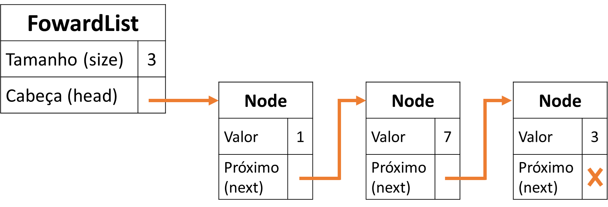

## Roteiro de Laboratório: Listas Encadeadas

### Introdução

**Listas encadeadas** são estruturas de dados dinâmicas que armazenam uma coleção de elementos, cada um contendo um dado e um ponteiro para o próximo elemento. Ao contrário dos vetores, as listas encadeadas não possuem um tamanho fixo pré-determinado, permitindo a inserção e remoção de elementos de forma eficiente em qualquer posição.



O objetivo deste laboratório será implementar as operações básicas de uma lista encadeada, compreendendo sua estrutura e funcionamento.

### Estrutura de um Nó

Cada nó contém dois atributos:

* **data:** Armazena o valor do elemento.
* **next:** Ponteiro para o próximo nó da lista.

Criaremos funções para alocar e inicializar um nó, para recuperar seus atributos e para destruir um nó. Crie um arquivo `node.h` com o seguinte conteúdo:

```c
#ifndef _NODE_H_
#define _NODE_H_

typedef data_type int;
typedef struct Node Node;

struct Node {
    data_type data;
    Node *next;
};

Node *node_construct(data_type value, Node *next);

data_type node_value(Node *node);
Node* node_next(Node *node);

void node_destroy(Node *node);

#endif
```

Implemente as funções no arquivo `node.c` e resolva a primeira questão do Testr. Para resolver esta questão, ainda não é necessário criar o tipo `ForwardList`.


### Estruturas de Listas Encadeadas

O tipo `ForwardList` será utilizado para encapsular (esconder do usuário da biblioteca) a gestão dos nós. O usuário terá acesso à uma interface de funções para, por exemplo, inserção, busca e remoção de elementos, sem ter contato com o tipo `Node`. Crie o arquivo `forward_list.h` contendo a seguinte estrutura:

```c
typedef struct
{
    Node *head;
    int size;
} ForwardList;
```

Ao longo deste laboratório, as funções abaixo deverão ser implementadas. Adicione suas assinaturas ao arquivo `forward_list.h` e siga os exercícios do Testr para implementar as funções sequencialmente.

```c
/**
 * @brief Construct a new Linked List:: Linked List object
 *  Allocates memory for a new linked list and returns a pointer to it.
 * @return ForwardList*
 * Pointer to the newly allocated linked list.
 * @note
 * The caller is responsible for freeing the memory allocated for the linked list using forward_list_destroy().
 *
 */
ForwardList *forward_list_construct();

/**
 * @brief Destroys the linked list.
 *  Frees the memory allocated for the linked list and all its nodes.
 * @param l
 * Pointer to the linked list.
 *
 */
void forward_list_destroy(ForwardList *l);

/**
 * @brief Returns the size of the linked list.
 *  Returns the number of nodes in the linked list.
 * @param l
 * Pointer to the linked list.
 * @return int
 * Number of nodes in the linked list.
 *
 */
int forward_list_size(ForwardList *l);

/**
 * @brief Pushes a new node to the front of the linked list.
 *  Allocates memory for a new node and inserts it at the front of the linked list.
 * @param l
 * Pointer to the linked list.
 * @param data
 * Pointer to the data to be stored in the new node.
 *
 */
void forward_list_push_front(ForwardList *l, data_type data);

/**
 * @brief Print the elements of the linked list.
 *  Print the elements of the linked list.
 * @param l
 * Pointer to the linked list.
 * @param print_fn
 * Pointer to the function to print data_type values.
 *
 */
void forward_list_print(ForwardList *l, void (*print_fn)(data_type));

/**
 * @brief Returns the data stored in the node at the given index.
 * @param l
 * Pointer to the linked list.
 * @param i
 * Index of the node.
 * @return data_type
 * Data stored in the node at the given index.
 *
 */
data_type forward_list_get(ForwardList *l, int i);

/**
 * @brief Remove the first node of the linked list and returns its data.
 * @param l
 * Pointer to the linked list.
 * @return data_type
 * Pointer to the data stored in the first node of the linked list that was removed.
 *
 */
data_type forward_list_pop_front(ForwardList *l);

/**
 * @brief Removes all nodes from the linked list.
 * Removes all nodes from the linked list and frees the memory allocated for them.
 * @param l
 * Pointer to the linked list.
 * @note
 * The caller is responsible for freeing the memory allocated for the data stored in the nodes.
 */
void forward_list_clear(ForwardList *l);

/**
 * @brief Removes all nodes with the given value from the linked list.
 * Removes all nodes with the given value from the linked list and frees the memory allocated for them.
 * @param l
 * Pointer to the linked list.
 * @param val
 * Value to be removed from the linked list.
 */
void forward_list_remove(ForwardList *l, data_type val);

/**
 * @brief Adds all nodes from the given list to the end of the linked list.
 * @param l
 * Pointer to the linked list.
 * @param m
 * Pointer to the linked list to be added to the end of the linked list.
 */
void forward_list_cat(ForwardList *l, ForwardList *m);

/**
 * @brief Sorts the linked list.
 * Sorts the linked list.
 * @param l
 * Pointer to the linked list.
 */
void forward_list_sort(ForwardList *l);


/**
 * @brief Create a new list given by the reverse of the given list.
 * @param l
 * Pointer to the linked list.
 * @return ForwardList*
 * Pointer to the newly allocated linked list.
 */
ForwardList *forward_list_reverse(ForwardList *l);

/**
 * @brief Removes all duplicate values from the linked list.
 * Removes all duplicate values from the linked list and frees the memory allocated for them.
 * @param l
 * Pointer to the linked list.
 * @note
 * The linked list must be sorted.
 */
void forward_list_unique(ForwardList *l);
```

