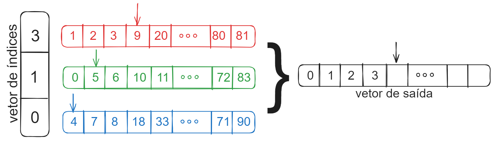

# Exercícios de Preparação para a P1

1. Dentre as estruturas de dados estudadas (vector, heap e array circular) quais são adequadas para implementar as operações de pilha com complexidade constante? E para implementar as operações de fila? Justifique.

<i style="color:pink">
Exemplo de Resposta: As operações de pilhas são a inserção e a remoção do elemento mais recente (last-in first-out). Vectors e arrays circulares podem ser usados para implementar estas operações com complexidade constante via inserção e remoção ao final. Filas possuem duas operações, a inserção e a remoção do elemento mais antigo (que foi inserido primeiro) da fila (first-in first-out). Para implementar as operações de fila, novos elementos devem ser inseridos em uma ponta da estrutura de dados e removidos da outra ponta. Arrays circulares são adequados por permitirem a inserção e remoção nas duas pontas (início e final) com complexidade constante. Vectors, por outro lado, permitem inserção e remoção ao final com complexidade constante, mas inserção e remoção no início têm complexidade linear.
</i>

1. Considere um conjunto de $k$ arquivos, cada um contendo um vetor de números ordenados de forma crescente. Seu objetivo é unir os dados destes vetores em um novo vetor, também ordenado de forma crescente. Algumas soluções possíveis são dadas a seguir. Sua tarefa é implementar as soluções e discutir suas complexidades em termos de uso de memória e tempo de computação.
   1. Ler um elemento de cada vez do arquivo e adicionar em um min-heap. Em seguida, remover iterativamente o menor elemento do heap de forma a retornar os dados de entrada em ordem.
   1. Ler os elementos um a um do arquivo e adicioná-los à um vector. Em seguida, ordenar o vector.
   1. Como ilustrado abaixo, ler os k vetores para a memória principal e, começando da primeira posição, comparar os $k$ elementos na posição $0$ e adicionar na saída o menor dentre eles. Se o menor elemento é do segundo vector, o índice de referência deste array é incrementado para a posição $1$ (enquanto continua sendo $0$ para os demais). Os elementos são comparados novamente, o menor é adicionado e o índice do respectivo array é incrementado. O processo se repete até que todos os elementos sejam adicionados na saída. Na figura, os elementos $0, 1, 2 e 3$ já foram inseridos. A estratégia consiste em manter um índice de referência por vector e caminhar com os índices enquanto elementos são adicionados no vetor de saída.

    

1. Dado um vector de inteiros e um inteiro $k$, retorne o $k^{ésimo}$ maior elemento no array. Implemente uma solução usando ordenação e outra usando heaps. Faça uma discussão comparando a complexidade das soluções em termos de memória e tempo.

1. (Desafio para queimar neurônios) Explique como implementar duas pilhas em um array A[1 . . n] de tal forma que nenhuma pilha estoure, a menos que o número total de elementos **em ambas as pilhas juntas** seja n. As operações PUSH e POP devem ser executadas em tempo O(1).

1.  [leetcode 225 e 232] Mostre como implementar uma pilha usando duas filas. Ou a operação de push ou a operação de pop deve ter complexidade O(1). A outra operação não pode ser pior que linear. Descreva também como implementar uma pilha usando apenas uma fila. As mesmas restrições sobre a complexidade se aplicam.

1. Um sistema de e-commerce se prepara vender ingressos para um show muito aguardado. É esperado que um grande número de usuários tente adquirir ingressos simultaneamente. Pedidos devem ser processados na ordem em que forem recebidos para garantir que as vendas serão realizadas de forma justa. É muito importante que nenhum perdido seja perdido e, para isto, os donos do sistema estão dispostos a realizar investimentos e garantir que os recursos que forem necessários estarão disponíveis. Que tipo abstrato de dados seria o mais adequada para armazenar os pedidos e como ele deveria ser implementada dado o contexto da aplicação? Justifique analisando a complexidade das operações, o uso de recursos computacionais e possíveis limitações do tipo abstratato de dados. Discuta alternativas e porque elas são menos adequadas.

1. Um roteador pode receber pacotes de dados de diversas origens e deve encaminhar estes pacotes para os respectivos destinos. Um determinado roteador foi configurado de forma que os pacotes fossem tratados na mesma ordem em que foram recebidos. Por ser um dispositivo de baixo custo, os recursos computacionais do roteador são limitados. O número de pacotes que o roteador é capaz de armazenar internamente é limitado pelo tamanho da memória do dispositivo. Se o limite for atingido e novos pacotes forem recebidos, eles devem ser descartados. Para  maximizar a performance da rede, o encaminhamento dos pacotes deve ser tão rápido quanto possível. Que tipo abstrato de dados seria o mais adequada para armazenar os pedidos e como ele deveria ser implementada dado o contexto da aplicação? Justifique analisando a complexidade das operações, o uso de recursos computacionais e possíveis limitações do tipo abstratato de dados. Discuta alternativas e porque elas são menos adequadas.

1. [leetcode 20] Dada uma string s contendo apenas os caracteres '(', ')', '{', '}', '[' e ']', determine se a string de entrada é válida. Uma string de entrada é válida se:
* Os colchetes abertos devem ser fechados pelo mesmo tipo de colchetes.
* Os colchetes abertos devem ser fechados na ordem correta.
* Cada colchete fechado tem um colchete aberto correspondente do mesmo tipo.

    **Example 1:**

    ```
    Input: s = "()"
    Output: true
    ```

    **Example 2:**

    ```
    Input: s = "()[]{}"
    Output: true
    ```

    **Example 3:**

    ```
    Input: s = "(]"
    Output: false
    ```

    Use um tipo abstrato de dados para resolver o problema e justifique sua implementação considerando funções providas pelo tipo e a performance das suas operações.

    **IMPORTANTE:** Em alguns problemas, o tipo abstrato de dados pode ser implementado usando tipos pré-existentes simples como arrays e pode não ser necessário criar novas structs.

1. Matrizes esparsas são aqueles em que a maioria dos elementos são nulos. Na computação, existem diversas formas de representar matrizes esparsas de forma a minimizar o uso de memória e o custo computacional de algumas operações. Em geral, estas representações armazenam apenas os elementos não-nulos da matriz. Como partimos do pressuposto que a quantidade de não-nulos é subtancialmente menor que a de zeros, estas representações trazem ganhos em relação à representação densa (a representação normal em que os valores nulos são armazenados na matriz). Considere uma estrutura de dados para matrizes esparsas dada por um vetor ordenado de nós em que:
* Cada nó representa um valor não nulo que contém o número da linha, da coluna e o valor.
* O vetor é ordenado pelo número da linha e, para itens na mesma linha, pelo número da coluna.

    **Exemplo 1**: A matriz

    ```
    | 0 7 8 |
    | 0 0 0 |
    | 4 5 6 |
    ```

    seria representada como:

    ```
    linha  | 0 0 2 2 2 |
    coluna | 1 2 0 1 2 |
    valor  | 7 8 4 5 6 |
    ```

    **Exemplo 2**: A matriz

    ```
    | 0 0 0 |
    | 0 0 3 |
    | 5 0 4 |
    ```

    seria representada como:

    ```
    linha  | 1 2 2 |
    coluna | 2 0 2 |
    valor  | 3 5 4 |
    ```

Escreva uma função que dada esta representação de matriz, permita recuperar o valor de um elemento a partir dos índices da linha e coluna com complexidade ```O(log2 n)```, onde ```n``` é o número de elementos não nulos. A função deve retornar valores nulos quando for o caso. A estrutura do tipo e a assinatura da função são dadas a seguir:

```
typedef struct
{
    int linha;
    int coluna;
    double valor;
} No;

typedef struct
{
    No *vals;  // array de valores não nulos
    int tam;   // numero de itens não nulos
} Matriz;

// funcao a ser implementada
double get(Matriz *m, int linha, int coluna);
```

1. Considerando a representação de matriz esparsa da questão anterior, explique como implementar as operações abaixo da forma mais eficiente quanto possível e discuta as complexidades da solução.

* Verificar se uma linha é nula.

* Verificar se uma coluna é nula.

* Recuperar os itens não nulos de uma linha.

* Recuperar os itens não nulos de uma coluna.

1. Considerando a representação de matriz esparsa da questão 12, implemente uma função que calcule o produto ponto a ponto entre duas matrizes esparsas e retorne a soma dos elementos da matriz resultante. A declaração da função é dada a seguir. Note que não é necessário construir a matriz resultante do produto ponto a ponto explicitamente.

```
double prod_sum(Matriz *m1, Matriz *m2);
```

1. Escreva a função de inserção em um heap de máximo que armazena inteiros.

1. Escreva a função de remoção do maior elemento, matendo a propriedade do heap, em um heap de máximo que armazena inteiros.

1.  Usando as duas funções acima, escreva uma função para ordenar um array de inteiros.

1. Implemente uma pilha genérica com operações de construir, destruir, empilhar e desempilhar usando um array alocado dinamicamente.

1. Implemente uma fila genérica com operações de construir, destruir, enfileirar e desenfileirar usando um array circular. Assuma que o array terá no máximo 10 elementos simultaneamente.

1. Enquanto uma pilha permite a inserção e exclusão de elementos em apenas uma extremidade, e uma fila permite a inserção em uma extremidade e a exclusão na outra extremidade, um deque (fila com duas extremidades) permite a inserção e exclusão em ambas as extremidades. Assumindo que é possível definir um número máximo de itens que serão inseridos no deque, use um array circular para implementar um deque e quatro procedimentos de tempo O(1) para inserir elementos e excluir elementos de ambas as extremidades.
